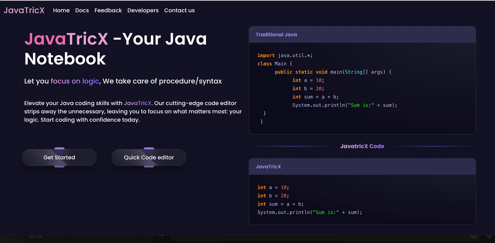
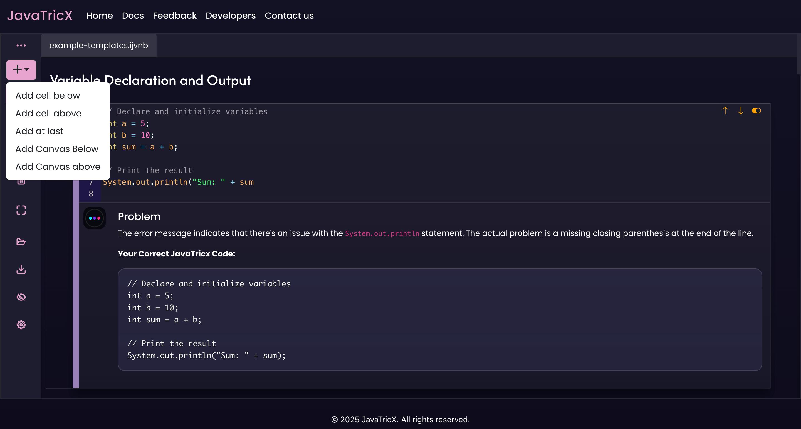
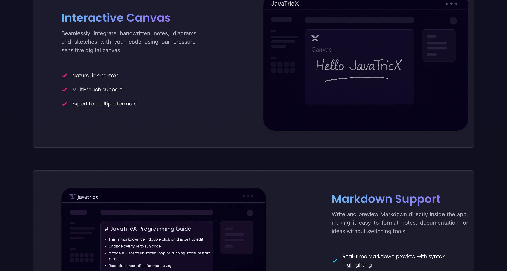

Architected an interactive Java notebook inspired by Jupyter, enhancing user experience through real-time collaboration features; the platform has now processed over 500 code submissions, fostering an environment of continuous learning and innovation.
• Integrated AI assistance for smart code suggestions and error correction.
• Engineered an advanced IntelliSense engine for autocompletion and inline documentation to remove boilerplate and
simplify user workflow.
*JavaTricX!* 🖥️
It lets you:
✅ Create interactive Java notebooks
✅ Write only logic and not focus on boilerplate code
✅ Share notebooks in real-time with others
✅ Re-use code among cells.
✅ Load and edit Java files with ease
Perfect for students, developers, and anyone learning Java!

